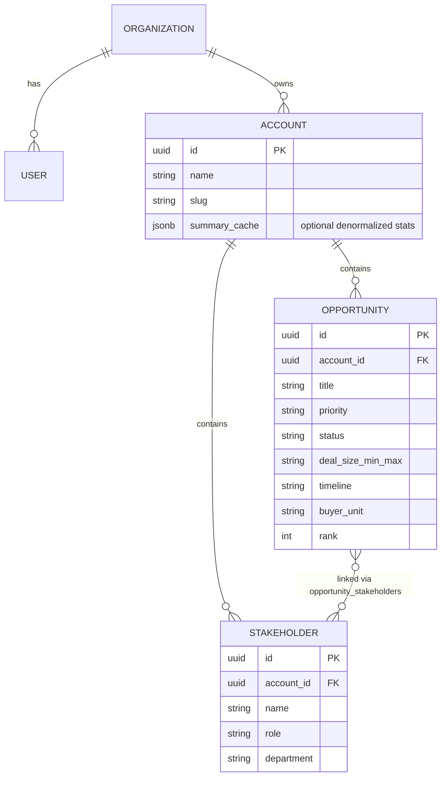

# DealAxis — Multi-bank data architecture

**Database first:** **[GETTING_STARTED.md](./GETTING_STARTED.md)** → Supabase + `db/schema.sql` + `db/seed.sql`. Details: **[DATABASE.md](./DATABASE.md)**.

## UI model (what you have now)

Each **bank** is an **account**. One page = one account:

```
Account (bank)
├── Summary (4 stat cards — per bank)
│   ├── Total opportunities (count)
│   ├── Opportunity range ($)
│   ├── Top service line themes (text)
│   └── Stakeholders (count)
└── Opportunities[] (cards below)
```

Switching banks = load a different `accountId` (URL, sidebar, or account picker).

Example API contract the frontend already expects:

```
GET /api/accounts/:accountId/landscape
→ { account: { id, name }, stats: [...], opportunities: [...] }
```

---

## Recommended data model (relational)



**Rules**

- Every opportunity belongs to exactly one `account_id` (bank).
- Stakeholders belong to the bank; link to opportunities with a junction table when you need “who owns this play.”
- The **4 summary boxes** can be:
  - **Computed on read** (SQL `COUNT`, `SUM`/`MIN`/`MAX` on deal size, `GROUP BY` service line theme), or
  - **Cached** on `accounts.summary_cache` and refreshed when opportunities change (better for heavy dashboards).

---

## Storage / backend recommendation

| Stage | Stack | Why |
|-------|--------|-----|
| **MVP (internal B2B)** | **PostgreSQL on Supabase** + Vite React; optional Netlify for hosting | Banks, opportunities, stakeholders; RLS per org when auth is on |
| **Auth** | **Supabase Auth** | Map users → `organization_id`; only show accounts that org can access |
| **API layer** | REST or tRPC from Next.js if you migrate off Vite | `GET /accounts`, `GET /accounts/:id/landscape`, `GET /accounts/:id/opportunities/:id` for expanded card |
| **Files / signals** | S3 or Supabase Storage | PDFs, news, earnings snippets referenced by opportunities—not in Postgres blobs |
| **Search later** | Postgres full-text or Typesense/Algolia | “Search accounts, opportunities, stakeholders…” in the top nav |

**Avoid for core CRM-style data:** plain JSON files or Firebase-only document trees—you will want joins (bank → opps → stakeholders) and aggregates for the 4 cards.

**When to add more:** Redis only if you cache landscape responses at scale; warehouse (BigQuery/Snowflake) only when analytics across all banks outgrow the app DB.

---

## Example Postgres shapes

```sql
-- accounts (banks)
CREATE TABLE accounts (
  id UUID PRIMARY KEY DEFAULT gen_random_uuid(),
  organization_id UUID NOT NULL REFERENCES organizations(id),
  name TEXT NOT NULL,
  slug TEXT UNIQUE NOT NULL,
  created_at TIMESTAMPTZ DEFAULT now()
);

-- opportunities
CREATE TABLE opportunities (
  id UUID PRIMARY KEY DEFAULT gen_random_uuid(),
  account_id UUID NOT NULL REFERENCES accounts(id) ON DELETE CASCADE,
  title TEXT NOT NULL,
  priority TEXT,
  status TEXT,
  deal_size_label TEXT,
  timeline TEXT,
  buyer TEXT,
  service_line_theme TEXT,
  rank INT DEFAULT 0
);

-- stakeholders (per bank)
CREATE TABLE stakeholders (
  id UUID PRIMARY KEY DEFAULT gen_random_uuid(),
  account_id UUID NOT NULL REFERENCES accounts(id) ON DELETE CASCADE,
  full_name TEXT NOT NULL,
  title TEXT,
  department TEXT
);
```

Landscape query (conceptual):

```sql
-- Total opportunities + range + themes + stakeholder count for one bank
SELECT
  (SELECT COUNT(*) FROM opportunities WHERE account_id = $1),
  (SELECT MIN(deal_min), MAX(deal_max) FROM opportunities WHERE account_id = $1),
  (SELECT string_agg(DISTINCT service_line_theme, ', ' ORDER BY service_line_theme)
   FROM (SELECT service_line_theme FROM opportunities WHERE account_id = $1 LIMIT 3) t),
  (SELECT COUNT(*) FROM stakeholders WHERE account_id = $1);
```

---

## Frontend routing (next step)

| Route | Loads |
|-------|--------|
| `/accounts` | List of banks |
| `/accounts/:accountId/opportunities` | Landscape page (4 cards + grid) |
| `/accounts/:accountId/stakeholders` | Stakeholder list for that bank |

Pass `accountId` into `OpportunitiesPage` from the router; `fetchAccountLandscape(accountId)` stays the single data entry point.

---

## Repo layout (suggested)

```
src/
  api/accounts.js          # fetchAccountLandscape — swap mock → HTTP
  data/mockData.js         # dev-only; delete when API is live
  pages/OpportunitiesPage.jsx
server/                    # optional separate API
  routes/accounts.ts
  db/
```

---

## Summary

- **One bank = one account** with **4 summary metrics** and **many opportunities**.
- Use **PostgreSQL on Supabase** as source of truth; client or API returns landscape per `accountId`.
- Frontend already follows this via `fetchAccountLandscape` in `src/api/accounts.js`.
